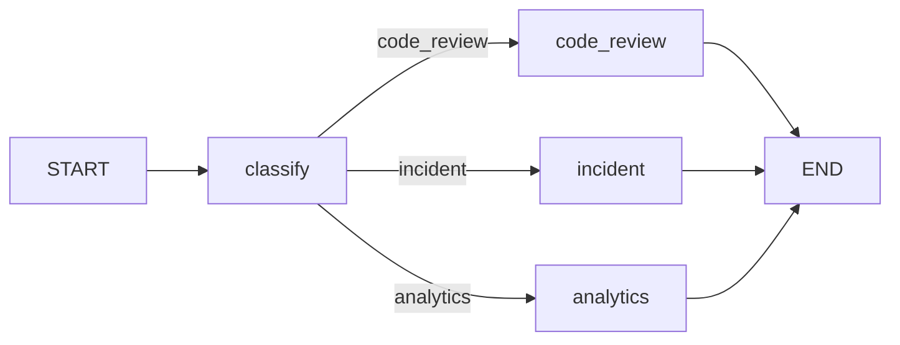

# Релиз 0 — готово

## Что сделано

- LangGraph-диспетчер в [`main.py`](../../main.py)
- Классификатор с structured output (`Route`: `code_review` / `incident` / `analytics`)
- Условная маршрутизация через `add_conditional_edges` + `route_by_category`
- Три LLM-заглушки: `handle_code_review`, `handle_incident`, `handle_analytics`
- Langfuse-заглушка: `get_callbacks()` при `LANGFUSE_ENABLED=false` возвращает `[]`
- 3 входных файла в [`data/`](../../data/)
- Шаблон [`.env`](../../.env) для ключей
- Аннотации перед каждой функцией, без комментариев внутри

## Структура

```
langchain2/
├── .cursor/plan/release-0.md
├── .cursor/done/release-0.md   ← этот файл
├── main.py
├── pyproject.toml
├── .env
├── .gitignore
└── data/
    ├── code_review.txt
    ├── incident.txt
    └── analytics.txt
```

## Как запустить

```bash
cd langchain2
# Заполни OPENAI_API_KEY в .env
uv sync
uv run main.py
```

Скрипт прогонит все 3 файла, выведет mermaid-схему графа, категорию и ответ обработчика, в конце — сводку `OK` / `MISMATCH`.

## Схема графа



## Langfuse (когда поднимешь)

В `.env` поставь:
```
LANGFUSE_ENABLED=true
LANGFUSE_PUBLIC_KEY=...
LANGFUSE_SECRET_KEY=...
```

## Прогон

Зависимости установлены (`uv sync` — OK).
Полный прогон с LLM не выполнен: в `.env` пустой `OPENAI_API_KEY`.
После добавления ключа — `uv run main.py`.

## Следующий шаг

Релиз 1: параллельные проверки в ветке `code_review`.
