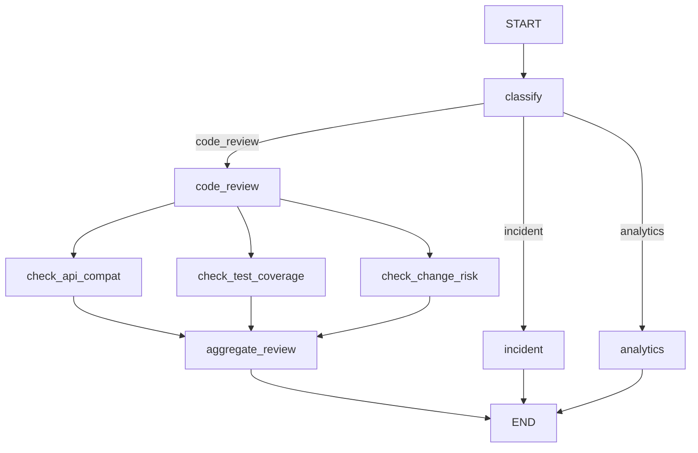

# Релиз 1 — готово

## Что сделано

- Ветка `code_review` заменена на fan-out/fan-in в [`main.py`](../../main.py)
- Три параллельные проверки:
  - `check_api_compat` — обратная совместимость API
  - `check_test_coverage` — покрытие тестами
  - `check_change_risk` — риск (auth, billing, migrations)
- Редьюсер `reviews: Annotated[list, operator.add]` — отчёты не затирают друг друга
- `aggregate_review` — structured verdict: `approve` / `changes_requested` / `block`
- Тестовые дифы:
  - [`data/code_review.txt`](../../data/code_review.txt) — рискованный (auth)
  - [`data/code_review_clean.txt`](../../data/code_review_clean.txt) — чистый (версия + тест)

## Схема графа



## Результаты прогона

| Диф | Вердикт |
|-----|---------|
| risky (auth) | block |
| clean (версия) | approve |

Маршрутизация: code_review, incident, analytics — все OK.

## Запуск

```bash
uv run main.py
```

## Следующий шаг

Релиз 2: orchestration в ветке `analytics`.
