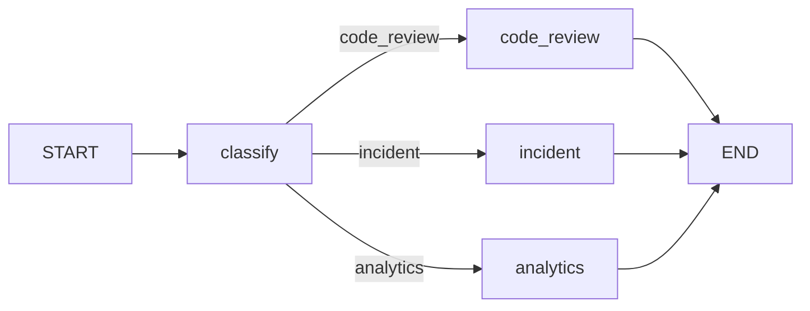

# Релиз 0: AI-диспетчер входящих задач (Routing)

## Цель

LangGraph-диспетчер: классификация входящего → условная маршрутизация → три LLM-заглушки.
Категории: `code_review` / `incident` / `analytics`.

## Схема графа



## Структура проекта

```
langchain2/
├── .cursor/plan/release-0.md
├── .cursor/done/release-0.md
├── pyproject.toml
├── .env
├── .gitignore
├── main.py
└── data/
    ├── code_review.txt
    ├── incident.txt
    └── analytics.txt
```

## Требования

- Модель: `gpt-5.4-mini`, `temperature=0`
- Классификатор — структурированный вывод (`Route`)
- Маршрут — `add_conditional_edges`, не tool-calling
- Langfuse — заглушка через `LANGFUSE_ENABLED=false`
- Аннотации перед функциями, без комментов внутри

## Что не делаем

- Бонус `confidence` / `needs_human`
- Релизы 1–5
