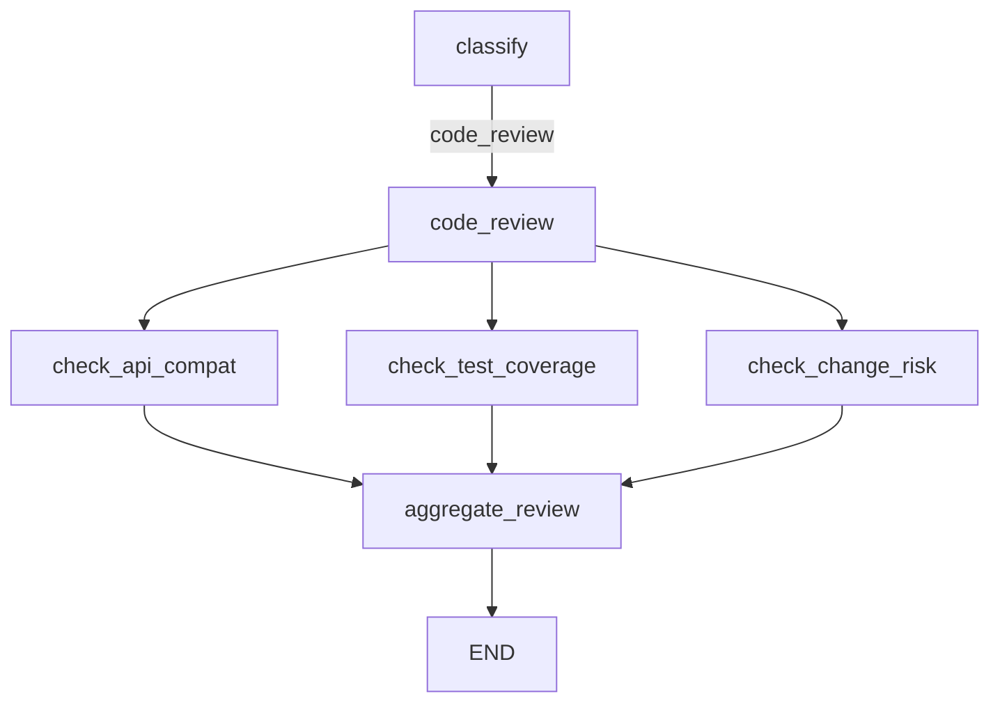

# Релиз 1: Parallelization — код-ревью

## Цель

Заменить заглушку `code_review` на fan-out/fan-in: 3 параллельные проверки → агрегатор с вердиктом.

## Оси проверок

- `check_api_compat` — обратная совместимость API
- `check_test_coverage` — покрытие тестами
- `check_change_risk` — риск (auth, billing, migrations)

## Схема

## Тестовые данные

- `data/code_review.txt` — рискованный (auth)
- `data/code_review_clean.txt` — чистый диф

## Вердикт агрегатора

`approve` / `changes_requested` / `block` — structured output
